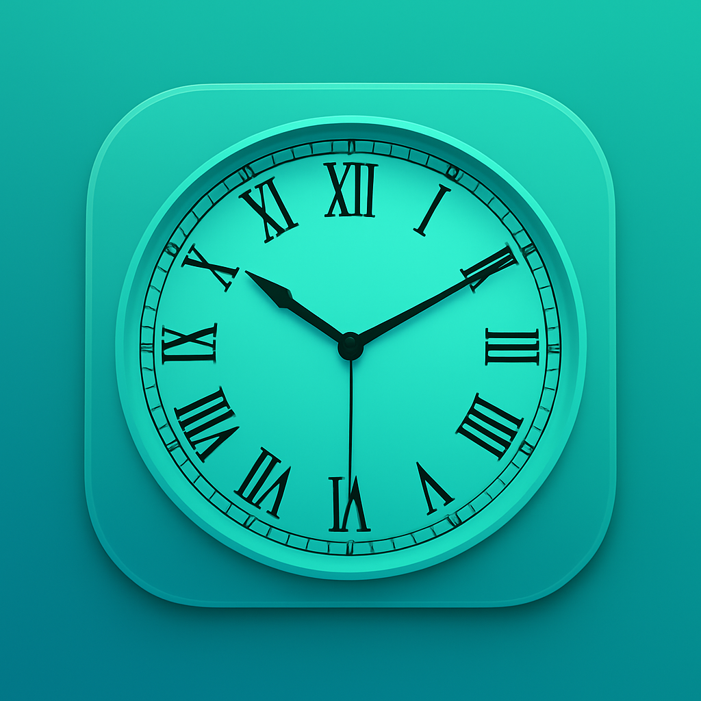
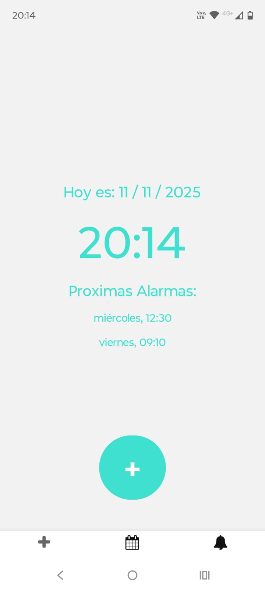
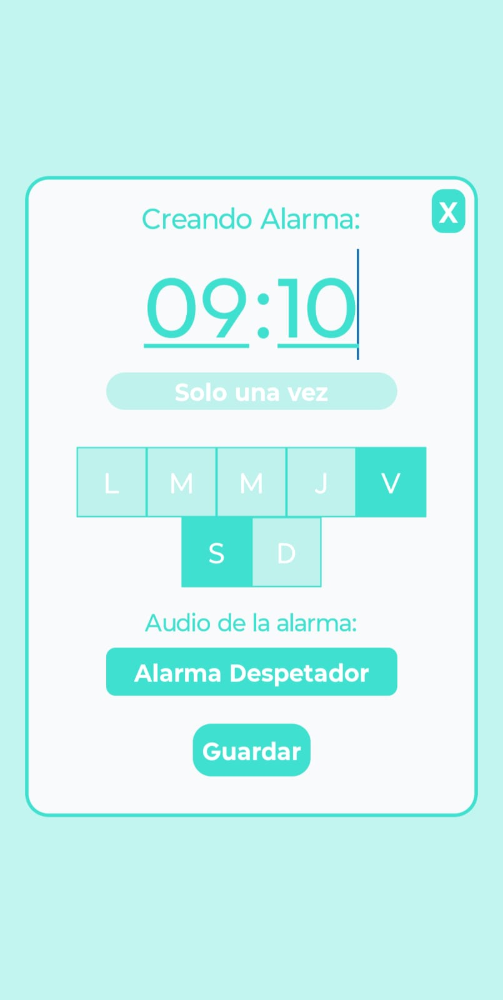
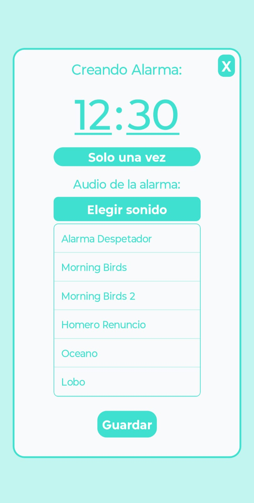
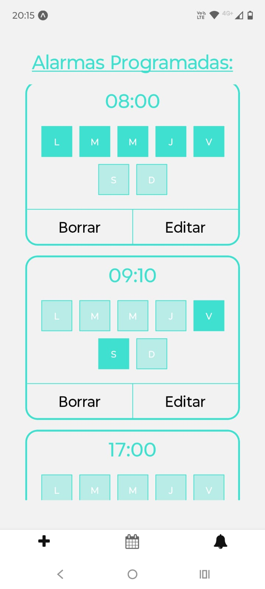
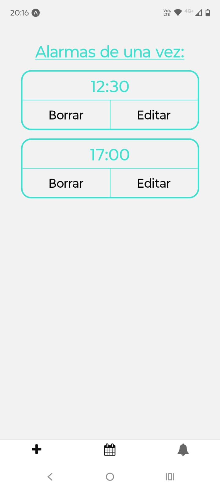

# ⏰ DespertApp

**Aplicación de alarmas desarrollada con React Native y Expo.**



---

## 🚀 Descripción

**DespertApp** es una aplicación de alarmas simples y personalizables.  
Permite configurar alarmas de una sola vez con hora y minutos específicos, elegir entre distintos sonidos, y recibir notificaciones locales con el tono seleccionado.

---

## 📌 Notas importantes

⚠️ Limitación de funcionamiento en segundo plano:
DespertApp necesita estar abierta en primer plano para que las alarmas se activen correctamente.
Debido a las limitaciones de Expo, las notificaciones y sonidos programados no se ejecutan si la aplicación está completamente cerrada o en segundo plano.
Esto se solucionará en futuras versiones con la implementación de un servicio nativo en segundo plano.

---

## 🧩 Características principales

- 🕐 **Creación y programación de alarmas.**
- 🎵 **Selección de sonido personalizado.**
- ✏️ **Edición y borrado de alarmas existentes.**
- 🔔 **Notificaciones programadas con sonido.**
- ⚙️ **Contexto global de alarmas** mediante `AlarmaContext`.
- 🎨 **Diseño visual propio** con colores definidos en `Global/colors.js`.
- 📱 **Compatible con Android (EAS Build).**
- 🧱 **Modal interactivo con validación de hora y minutos.**

---

## 🛠️ Tecnologías utilizadas

- **React Native**
- **Expo**
- **Expo Notifications**
- **Expo AV / Expo Audio**
- **Context API**
- **EAS Build**
- **React Navigation**

---

## ⚙️ Dependencias principales

```json
"dependencies": {
  "@react-native-async-storage/async-storage": "2.2.0",
  "@react-navigation/bottom-tabs": "^7.4.7",
  "@react-navigation/native": "^7.1.17",
  "@react-navigation/native-stack": "^7.3.26",
  "expo": "~54.0.7",
  "expo-audio": "~1.0.13",
  "expo-av": "~16.0.7",
  "expo-notifications": "~0.32.12",
  "expo-status-bar": "~3.0.8",
  "react": "19.1.0",
  "react-native": "0.81.4",
  "react-native-safe-area-context": "~5.6.0",
  "react-native-screens": "~4.16.0"
}
```

---

## 🧰 Instalación y ejecución

```bash
git clone https://github.com/tuusuario/despertapp.git
cd despertapp
npm install
npx expo start
```

---

## 📦 Build con EAS

#### 🔑 Login en EAS

- **eas login**

#### ⚙️ Prebuild (solo una vez)

- **npx expo prebuild**

#### 🧱 Crear build para Android

- **eas build -p android**

###### ⚠️ En Windows no se puede ejecutar un build local (--local), se debe hacer el build remoto en los servidores de Expo.

#### 📲 Una vez completado

- **Descargá el .apk o .aab generado desde tu panel en https://expo.dev/accounts**

---

## 📸 Capturas de pantalla

<p >
  
  
  
  
  
</p>
---

## 👨‍💻 Autor

#### Iván Braun

##### ✉️ ivangabraun@gmail.com

---

#### ❤️ Proyecto personal desarrollado con pasión y dedicación, con el objetivo de mejorar mi experiencia en React Native.
